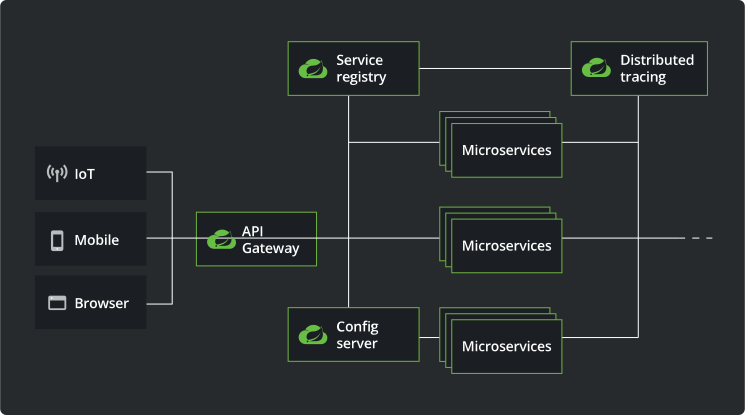
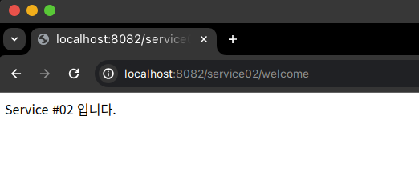

# 유레카 서비스 샘플 ( Eureka Service #02 )

## Spring Cloud 아키텍처 관계도

출처 : https://spring.io/cloud

## 개발환경
- JDK : Zulu JDK 17.0.10
- SpringBoot : 3.2.3
  - `org.springframework.boot:spring-boot-starter-web`
  - `org.springframework.cloud:spring-cloud-starter-netflix-eureka-client`
- SpringBoot Eureka Client : 현재 최신버전 4.1.0
- build tools : Gradle

## Spring Cloud 버전과 Spring Boot 버전 및 JDK 의 버전 호환성
- 출처
```text
https://spring.io/projects/spring-cloud#overview  
https://github.com/spring-projects/spring-framework/wiki/Spring-Framework-Versions
```
| Release Train        | Spring Boot Generation                | JDK 버전 ( LTS ) | 비고   |
|----------------------|---------------------------------------|----------------|------|
| 2023.0.x aka Leyton  | 3.2.x                                 | JDK 17         |      |
| 2022.0.x aka Kilburn | 3.0.x, 3.1.x (Starting with 2022.0.3) | JDK 17         |      |
| 2021.0.x aka Jubilee | 2.6.x, 2.7.x (Starting with 2021.0.3) | JDK 11         |      |
| 2020.0.x aka Ilford  | 2.4.x, 2.5.x (Starting with 2020.0.3) | JDK 11         |      |
| Hoxton               | 2.2.x, 2.3.x (Starting with SR5)      | JDK 8, 11      |      |
| Greenwich            | 2.1.x                                 | JDK 8          | 지원종료 |
| Finchley             | 2.0.x                                 | JDK 8          | 지원종료 |
| Edgware              | 1.5.x                                 | JDK 6, 7, 8    | 지원종료 |
| Dalston              | 1.5.x                                 | JDK 6, 7, 8    | 지원종료 |

## Source
- 유레카 서버(Erureka Client)의 개발은 간단하다.
- 기본적으로 3개의 파일만 필요하다.
  - `build.gradle`, `EurekaService02Application.java`,`application.yml`

#### build.gradle
```gradle
plugins {
    id 'java'
    id 'org.springframework.boot' version '3.2.4'
    id 'io.spring.dependency-management' version '1.1.4'
}

group = 'octopus'
version = '0.0.1-SNAPSHOT'

java {
    sourceCompatibility = '17'
}

configurations {
    compileOnly {
        extendsFrom annotationProcessor
    }
}

repositories {
    mavenCentral()
}

ext {
    set('springCloudVersion', "2023.0.0")
}

dependencies {
    implementation 'org.springframework.boot:spring-boot-starter-web'
    implementation 'org.springframework.cloud:spring-cloud-starter-netflix-eureka-client'

    compileOnly 'org.projectlombok:lombok'
    annotationProcessor 'org.projectlombok:lombok'

    testImplementation 'org.springframework.boot:spring-boot-starter-test'
}

dependencyManagement {
    imports {
        mavenBom "org.springframework.cloud:spring-cloud-dependencies:${springCloudVersion}"
    }
}

tasks.named('test') {
    useJUnitPlatform()
}
```

#### EurekaService02Application.java
```java
package octopus;

import org.springframework.boot.SpringApplication;
import org.springframework.boot.autoconfigure.SpringBootApplication;

@SpringBootApplication
public class EurekaService02Application {

  public static void main(String[] args) {
    SpringApplication.run(EurekaService02Application.class, args);
  }

}
```
#### ServiceController.java
```java
package octopus.service;

import jakarta.servlet.http.HttpServletRequest;
import lombok.extern.slf4j.Slf4j;
import org.springframework.beans.factory.annotation.Autowired;
import org.springframework.core.env.Environment;
import org.springframework.web.bind.annotation.GetMapping;
import org.springframework.web.bind.annotation.RequestHeader;
import org.springframework.web.bind.annotation.RestController;
import org.springframework.web.bind.annotation.RequestMapping;

import java.util.Collections;
import java.util.Enumeration;

@RestController
@RequestMapping("/service02")
@Slf4j
public class ServiceController {
  Environment env;

  @Autowired
  public ServiceController(Environment env) {
    this.env = env;
  }

  @GetMapping("/welcome")
  public String welcome() {
    return "Service #02 입니다.";
  }

  @GetMapping("/message")
  public String message(@RequestHeader("first-request") String header) {
    log.info(header);
    return "Service #02 입니다.";
  }

  @GetMapping("/check")
  public String check(HttpServletRequest request) {
    Enumeration<String> headers = request.getHeaderNames();
    Collections.list(headers).stream().forEach(name -> {
      Enumeration<String> values = request.getHeaders(name);
      Collections.list(values).stream().forEach(value -> System.out.println(name + "=" + value));
    });

    log.info("Server port={}", request.getServerPort());

    log.info("spring.cloud.client.hostname={}", env.getProperty("spring.cloud.client.hostname"));
    log.info("spring.cloud.client.ip-address={}", env.getProperty("spring.cloud.client.ip-address"));

    return String.format("Service #01 입니다. PORT %s"
            , env.getProperty("local.server.port"));
  }
}
```

#### application.yml
```yml
server:
  port: 8082

spring:
  application:
    name: Eureka-Service-02

eureka:
  client:
    register-with-eureka: true
    fetch-registry: true
    service-url:
      defaultZone: http://localhost:8761/eureka
  instance:
    instance-id: ${spring.cloud.client.ip-address}:${spring.application.instance_id:${random.value}}
    prefer-ip-address: true
```

## Build
#### 프로젝트 디렉토리에서 실행한다.
```text
$ ./gradlew bootJar
```

## 실행
#### 파일 찾기
```text
$ find . -name '*.jar'                                   
./gradle/wrapper/gradle-wrapper.jar
./build/libs/EurekaService02-0.0.1-SNAPSHOT.jar
```

#### Client 실행
- 실행 방법은 여러 가지 가 있습니다.
1. Jar 파일 생성
- [프로젝트 디렉토리]/build/libs 폴더에 Build 됨.
- `java -jar EurekaService02-0.0.1-SNAPSHOT.jar `
```text
# java -jar ./workspace/EurekaServer/build/libs/EurekaService02-0.0.1-SNAPSHOT.jar
# java -jar EurekaService02-0.0.1-SNAPSHOT.jar                               

  .   ____          _            __ _ _
 /\\ / ___'_ __ _ _(_)_ __  __ _ \ \ \ \
( ( )\___ | '_ | '_| | '_ \/ _` | \ \ \ \
 \\/  ___)| |_)| | | | | || (_| |  ) ) ) )
  '  |____| .__|_| |_|_| |_\__, | / / / /
 =========|_|==============|___/=/_/_/_/
 :: Spring Boot ::                (v3.2.3)
```
2. Eclipse 또는 IntelliJ에서 실행
3. Maven 또는 Gradle 로 실행
  - Maven 실행 : ./mvn spring-boot:run -Dspring-boot.run.jvmArguments='-Dserver.port=8082'
  - Gradle 실행 : ./gradlew bootRun --args='--server.port=8082'

## 브라우저 실행


## Git Push
```git
git init
git add README.md
git commit -m "first commit"
git branch -M main
git remote add origin https://github.com/hermeswing/EurekaService02.git
git push -u origin main
```

## 오류
```text
com.netflix.discovery.shared.transport.TransportException: Cannot execute request on any known server
	at com.netflix.discovery.shared.transport.decorator.RetryableEurekaHttpClient.execute(RetryableEurekaHttpClient.java:112) ~[eureka-client-2.0.1.jar:2.0.1]
	at com.netflix.discovery.shared.transport.decorator.EurekaHttpClientDecorator.register(EurekaHttpClientDecorator.java:56) ~[eureka-client-2.0.1.jar:2.0.1]
	at com.netflix.discovery.shared.transport.decorator.EurekaHttpClientDecorator$1.execute(EurekaHttpClientDecorator.java:59) ~[eureka-client-2.0.1.jar:2.0.1]
	at com.netflix.discovery.shared.transport.decorator.SessionedEurekaHttpClient.execute(SessionedEurekaHttpClient.java:77) ~[eureka-client-2.0.1.jar:2.0.1]
	at com.netflix.discovery.shared.transport.decorator.EurekaHttpClientDecorator.register(EurekaHttpClientDecorator.java:56) ~[eureka-client-2.0.1.jar:2.0.1]
	at com.netflix.discovery.DiscoveryClient.register(DiscoveryClient.java:820) ~[eureka-client-2.0.1.jar:2.0.1]
	at com.netflix.discovery.InstanceInfoReplicator.run(InstanceInfoReplicator.java:121) ~[eureka-client-2.0.1.jar:2.0.1]
	at com.netflix.discovery.InstanceInfoReplicator$1.run(InstanceInfoReplicator.java:101) ~[eureka-client-2.0.1.jar:2.0.1]
	at java.base/java.util.concurrent.Executors$RunnableAdapter.call(Executors.java:539) ~[na:na]
	at java.base/java.util.concurrent.FutureTask.run(FutureTask.java:264) ~[na:na]
	at java.base/java.util.concurrent.ScheduledThreadPoolExecutor$ScheduledFutureTask.run(ScheduledThreadPoolExecutor.java:304) ~[na:na]
	at java.base/java.util.concurrent.ThreadPoolExecutor.runWorker(ThreadPoolExecutor.java:1136) ~[na:na]
	at java.base/java.util.concurrent.ThreadPoolExecutor$Worker.run(ThreadPoolExecutor.java:635) ~[na:na]
	at java.base/java.lang.Thread.run(Thread.java:840) ~[na:na]

2024-03-27T22:26:05.813+09:00  WARN 29495 --- [Eureka-Service#01] [nfoReplicator-0] c.n.discovery.InstanceInfoReplicator     : There was a problem with the instance info replicator

com.netflix.discovery.shared.transport.TransportException: Cannot execute request on any known server
	at com.netflix.discovery.shared.transport.decorator.RetryableEurekaHttpClient.execute(RetryableEurekaHttpClient.java:112) ~[eureka-client-2.0.1.jar:2.0.1]
	at com.netflix.discovery.shared.transport.decorator.EurekaHttpClientDecorator.register(EurekaHttpClientDecorator.java:56) ~[eureka-client-2.0.1.jar:2.0.1]
	at com.netflix.discovery.shared.transport.decorator.EurekaHttpClientDecorator$1.execute(EurekaHttpClientDecorator.java:59) ~[eureka-client-2.0.1.jar:2.0.1]
	at com.netflix.discovery.shared.transport.decorator.SessionedEurekaHttpClient.execute(SessionedEurekaHttpClient.java:77) ~[eureka-client-2.0.1.jar:2.0.1]
	at com.netflix.discovery.shared.transport.decorator.EurekaHttpClientDecorator.register(EurekaHttpClientDecorator.java:56) ~[eureka-client-2.0.1.jar:2.0.1]
	at com.netflix.discovery.DiscoveryClient.register(DiscoveryClient.java:820) ~[eureka-client-2.0.1.jar:2.0.1]
	at com.netflix.discovery.InstanceInfoReplicator.run(InstanceInfoReplicator.java:121) ~[eureka-client-2.0.1.jar:2.0.1]
	at com.netflix.discovery.InstanceInfoReplicator$1.run(InstanceInfoReplicator.java:101) ~[eureka-client-2.0.1.jar:2.0.1]
	at java.base/java.util.concurrent.Executors$RunnableAdapter.call(Executors.java:539) ~[na:na]
	at java.base/java.util.concurrent.FutureTask.run(FutureTask.java:264) ~[na:na]
	at java.base/java.util.concurrent.ScheduledThreadPoolExecutor$ScheduledFutureTask.run(ScheduledThreadPoolExecutor.java:304) ~[na:na]
	at java.base/java.util.concurrent.ThreadPoolExecutor.runWorker(ThreadPoolExecutor.java:1136) ~[na:na]
	at java.base/java.util.concurrent.ThreadPoolExecutor$Worker.run(ThreadPoolExecutor.java:635) ~[na:na]
	at java.base/java.lang.Thread.run(Thread.java:840) ~[na:na]

2024-03-27T22:26:35.779+09:00  INFO 29495 --- [Eureka-Service#01] [tbeatExecutor-0] c.n.d.s.t.d.RedirectingEurekaHttpClient  : Request execution error. endpoint=DefaultEndpoint{ serviceUrl='http://localhost:8761/eureka/}, exception=Error while extracting response for type [class com.netflix.appinfo.InstanceInfo] and content type [application/json] stacktrace=org.springframework.web.client.RestClientException: Error while extracting response for type [class com.netflix.appinfo.InstanceInfo] and content type [application/json]
	at org.springframework.web.client.HttpMessageConverterExtractor.extractData(HttpMessageConverterExtractor.java:118)
	at org.springframework.web.client.RestTemplate$ResponseEntityResponseExtractor.extractData(RestTemplate.java:1159)
	at org.springframework.web.client.RestTemplate$ResponseEntityResponseExtractor.extractData(RestTemplate.java:1142)
	at org.springframework.web.client.RestTemplate.doExecute(RestTemplate.java:892)
	at org.springframework.web.client.RestTemplate.execute(RestTemplate.java:790)
	at org.springframework.web.client.RestTemplate.exchange(RestTemplate.java:672)
	at org.springframework.cloud.netflix.eureka.http.RestTemplateEurekaHttpClient.sendHeartBeat(RestTemplateEurekaHttpClient.java:99)
	at com.netflix.discovery.shared.transport.decorator.EurekaHttpClientDecorator$3.execute(EurekaHttpClientDecorator.java:92)
	at com.netflix.discovery.shared.transport.decorator.RedirectingEurekaHttpClient.executeOnNewServer(RedirectingEurekaHttpClient.java:121)
	at com.netflix.discovery.shared.transport.decorator.RedirectingEurekaHttpClient.execute(RedirectingEurekaHttpClient.java:80)
	at com.netflix.discovery.shared.transport.decorator.EurekaHttpClientDecorator.sendHeartBeat(EurekaHttpClientDecorator.java:89)
	at com.netflix.discovery.shared.transport.decorator.EurekaHttpClientDecorator$3.execute(EurekaHttpClientDecorator.java:92)
	at com.netflix.discovery.shared.transport.decorator.RetryableEurekaHttpClient.execute(RetryableEurekaHttpClient.java:120)
	at com.netflix.discovery.shared.transport.decorator.EurekaHttpClientDecorator.sendHeartBeat(EurekaHttpClientDecorator.java:89)
	at com.netflix.discovery.shared.transport.decorator.EurekaHttpClientDecorator$3.execute(EurekaHttpClientDecorator.java:92)
	at com.netflix.discovery.shared.transport.decorator.SessionedEurekaHttpClient.execute(SessionedEurekaHttpClient.java:77)
	at com.netflix.discovery.shared.transport.decorator.EurekaHttpClientDecorator.sendHeartBeat(EurekaHttpClientDecorator.java:89)
	at com.netflix.discovery.DiscoveryClient.renew(DiscoveryClient.java:837)
	at com.netflix.discovery.DiscoveryClient$HeartbeatThread.run(DiscoveryClient.java:1401)
	at java.base/java.util.concurrent.Executors$RunnableAdapter.call(Executors.java:539)
	at java.base/java.util.concurrent.FutureTask.run(FutureTask.java:264)
	at java.base/java.util.concurrent.ThreadPoolExecutor.runWorker(ThreadPoolExecutor.java:1136)
	at java.base/java.util.concurrent.ThreadPoolExecutor$Worker.run(ThreadPoolExecutor.java:635)
	at java.base/java.lang.Thread.run(Thread.java:840)
Caused by: org.springframework.http.converter.HttpMessageNotReadableException: JSON parse error: Root name ('timestamp') does not match expected ('instance') for type `com.netflix.appinfo.InstanceInfo`
	at org.springframework.http.converter.json.AbstractJackson2HttpMessageConverter.readJavaType(AbstractJackson2HttpMessageConverter.java:406)
	at org.springframework.http.converter.json.AbstractJackson2HttpMessageConverter.read(AbstractJackson2HttpMessageConverter.java:354)
	at org.springframework.web.client.HttpMessageConverterExtractor.extractData(HttpMessageConverterExtractor.java:103)
	... 23 more
Caused by: com.fasterxml.jackson.databind.exc.MismatchedInputException: Root name ('timestamp') does not match expected ('instance') for type `com.netflix.appinfo.InstanceInfo`
 at [Source: (org.springframework.util.StreamUtils$NonClosingInputStream); line: 1, column: 2] (through reference chain: com.netflix.appinfo.InstanceInfo["timestamp"])
	at com.fasterxml.jackson.databind.exc.MismatchedInputException.from(MismatchedInputException.java:63)
	at com.fasterxml.jackson.databind.DeserializationContext.reportPropertyInputMismatch(DeserializationContext.java:1787)
	at com.fasterxml.jackson.databind.DeserializationContext.reportPropertyInputMismatch(DeserializationContext.java:1803)
	at com.fasterxml.jackson.databind.deser.DefaultDeserializationContext._unwrapAndDeserialize(DefaultDeserializationContext.java:348)
	at com.fasterxml.jackson.databind.deser.DefaultDeserializationContext.readRootValue(DefaultDeserializationContext.java:320)
	at com.fasterxml.jackson.databind.ObjectReader._bindAndClose(ObjectReader.java:2105)
	at com.fasterxml.jackson.databind.ObjectReader.readValue(ObjectReader.java:1481)
	at org.springframework.http.converter.json.AbstractJackson2HttpMessageConverter.readJavaType(AbstractJackson2HttpMessageConverter.java:395)
	... 25 more
```
- 특수문자 오류임
```yaml
server:
  port: 8081

spring:
  application:
    name: Eureka-Service#01

eureka:
  client:
    register-with-eureka: true
    fetch-registry: true
    service-url:
      defaultZone: http://localhost:8761/eureka/
  instance:
    instance-id: ${spring.cloud.client.ip-address}:${spring.application.instance_id:${random.value}}
    prefer-ip-address: true
```
  - ***'Eureka-Service#01' 를 'Eureka-Service-01' 로 변경하니 해결됨.***
```yaml
server:
  port: 8081

spring:
  application:
    name: Eureka-Service-01

eureka:
  client:
    register-with-eureka: true
    fetch-registry: true
    service-url:
      defaultZone: http://localhost:8761/eureka/
  instance:
    instance-id: ${spring.cloud.client.ip-address}:${spring.application.instance_id:${random.value}}
    prefer-ip-address: true
```

## 참고.
> https://github.com/eugenp/tutorials/tree/master/spring-cloud-modules  
> https://velog.io/@rockstar/Spring-Cloud-Eureka-Server-%EC%84%A4%EC%A0%95-%EB%B0%8F-MSA-%ED%86%B5%EC%8B%A0-%EB%B0%A9%EB%B2%95  
> https://velog.io/@ililil9482/MSA-%EA%B5%AC%EC%84%B1-Discovery-Gateway-Config  
> https://github.com/Jimoou/springboot-microservices?tab=readme-ov-file  
